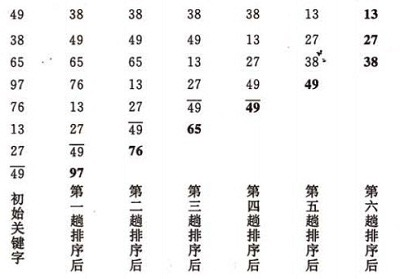
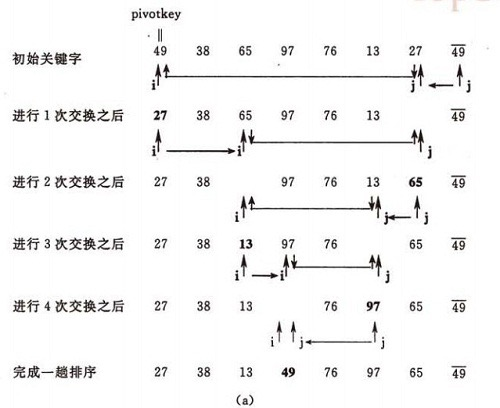
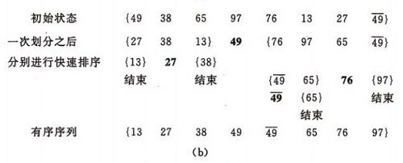

## 冒泡排序（bubble sort）
基本思想:  
&emsp;&emsp;在要排序的一组数中，对当前还未排好序的范围内的全部数，自上而下对相邻的两个数依次进行比较和调整，让较大的数往下沉，较小的往上冒。即：每当两相邻的数比较后发现它们的排序与排序要求相反时，就将它们互换。  
冒泡排序的示例：  
   
示例代码：  
``` c#
public static int[] SimpleBubbleSort(int[] list){
    var length = list?.Length;
    if(length<=1) return list;
    for(var i=0;i<length;i++){
        //从第0个元素开始，到倒数第二个元素，依次对比冒泡。
        for(var j=0;j<length-1-i;j++){
            if(list[j]>list[j+1]){
            var temp = list[j];
            list[j]=list[j+1];
            list[j+1]=temp;
            }
        }          
    }
    return list;
} 
```
***
## 冒泡排序的常用改进（bubble sort）

### 设置标志变量
&emsp;&emsp;设置一标志性变量pos,用于记录每趟排序中最后一次进行交换的位置。由于pos位置之后的记录均已交换到位,故在进行下一趟排序时只要扫描到pos位置即可。  
改进后算法如下:  
``` c#
public static int[] BubbleWithFlagSort(int[] list){
    var length = list?.Length;
    if(length<=1) return list;
    int i = (int)length-1;
    while(i>0){
        int pos = 0;
        for(var j=0;j<i;j++){
            if(list[j]>list[j+1]){
                pos = j;
                var temp = list[j];
                list[j]=list[j+1];
                list[j+1]=temp;
            }
        }
        i = pos;
    }       
    return list;
}
```
### 同时取最大值和最小值
&emsp;&emsp;传统冒泡排序中每一趟排序操作只能找到一个最大值或最小值,我们考虑利用在每趟排序中进行正向和反向两遍冒泡的方法一次可以得到两个最终值(最大者和最小者) , 从而使排序趟数几乎减少了一半。  
改进后的算法实现为:  
``` c#
public static int[] BubbleTwoSidesSort(int[] list){
    var length = list?.Length;
    if(length<=1) return list;
    int low =0;
    int high = (int)length-1;
    while(low<high){           
        for(var j=low;j<high;j++){
            if(list[j]>list[j+1]){
                var temp = list[j];
                list[j]=list[j+1];
                list[j+1]=temp;
            }                             
        }
        high--;
        for(var j=high;j>low;j--){
            if(list[j]<list[j-1]){
                var temp = list[j];
                list[j]=list[j-1];
                list[j-1]=temp;
            }
        }
        low++;
    }       
    return list;
}
```
 - - -

## 快速排序
基本思想:  
1. 选择一个基准元素,通常选择第一个元素或者最后一个元素,
2. 通过一趟排序讲待排序的记录分割成独立的两部分，其中一部分记录的元素值均比基准元素值小。另一部分记录的 元素值比基准值大。
3. 此时基准元素在其排好序后的正确位置
4. 然后分别对这两部分记录用同样的方法继续进行排序，直到整个序列有序。  
 
快速排序的示例： 
* 一趟排序的过程： 
  
* 排序的全过程：
 


示例代码：   
``` c#
public static int[] QuickSort(int[] list){
    var length = list?.Length;
    if(length<=1) return list;
    QuickSort(list,0,(int)length-1);
    return list;
}

private static void QuickSort(int[] list, int low, int high){
    if(low<high){
        int privotIndex = Partition(list, low, high);
        QuickSort(list, low, privotIndex -1);
        QuickSort(list, privotIndex+1, high);
    }
}
private static int Partition(int[] list,int low,int high){
    var pivot = list[low];
    while(low<high){
        //从高到低，跳过本来就比标的值大的
        while(low<high&&list[high]>=pivot) high--;
        //交换比标的值小的
        var temp1 = list[low];
        list[low]=list[high];
        list[high]=temp1;
        //从低到高，跳过本来就比标的值小的
        while(low<high&&list[low]<=pivot) low++;
        //交换比标的大的
        var temp2 = list[low];
        list[low]=list[high];
        list[high]=temp2;
    }
    return low;
}
```

分析：  
快速排序是通常被认为在同数量级（O(nlog2n)）的排序方法中平均性能最好的。但若初始序列按关键码有序或基本有序时，快排序反而蜕化为冒泡排序。为改进之，通常以“三者取中法”来选取基准记录，即将排序区间的两个端点与中点三个记录关键码居中的调整为支点记录。快速排序是一个不稳定的排序方法。

### 快速排序的改进
&emsp;&emsp;在本改进算法中,只对长度大于k的子序列递归调用快速排序,让原序列基本有序，然后再对整个基本有序序列用插入排序算法排序。实践证明，改进后的算法时间复杂度有所降低，且当k取值为 8 左右时,改进算法的性能最佳。  
示例代码：  
``` c#
public static int[] ImprovedQuickSort(int[] list){
    var length = list?.Length;
    if(length<=1) return list;
    //对子序列大于8个元素时才进行快速排序,实验证明8的时候性能最佳
    QuickSort(list,0,(int)length-1,8);
    //对快速排序后的序列进行插入排序
    for(var i=1;i<length;i++){
        int tmp = list[i];
        int j = i-1;
        while(j>=0&&tmp<list[j]){
            list[j+1]=list[j];
            j--;
        }
        list[j+1] = tmp;
    }
    return list;
}

private static void QuickSort(int[] list, int low, int high, int k){
    if(high - low > k){
        int privotIndex = Partition(list, low, high);
        QuickSort(list, low, privotIndex -1);
        QuickSort(list, privotIndex+1, high);
    }
}
private static int Partition(int[] list,int low,int high){
    var pivot = list[low];
    while(low<high){
        //从高到低，跳过本来就比标的值大的
        while(low<high&&list[high]>=pivot) high--;
        //交换比标的值小的
        var temp1 = list[low];
        list[low]=list[high];
        list[high]=temp1;
        //从低到高，跳过本来就比标的值小的
        while(low<high&&list[low]<=pivot) low++;
        //交换比标的大的
        var temp2 = list[low];
        list[low]=list[high];
        list[high]=temp2;
    }
    return low;
}
```