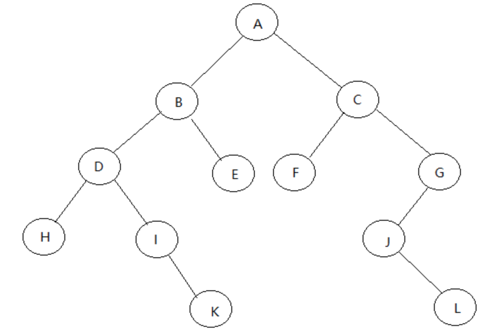

先给出一道很简单，喜闻乐见的二叉树算法题：

给出一个二叉查找树和一个目标值，如果其中有两个元素的和等于目标值则返回真，否则返回假。

例如：
```
Input:  
    5  
   / \  
  3   6  
 / \   \  
2   4   7  
```
Target = 9

Output: True
```
Input: 
    5
   / \
  3   6
 / \   \
2   4   7
```
Target = 28

Output: False
　


### 什么是二叉树？

二叉树是每个节点最多有两个子树的树结构。  
- - -
### 什么是二叉查找树（binary search tree）

二叉排序树或者是一棵空树，或者是具有下列性质的二叉树：
* 若左子树不空，则左子树上所有结点的值均小于或等于它的根结点的值；
* 若右子树不空，则右子树上所有结点的值均大于或等于它的根结点的值；
* 左、右子树也分别为二叉排序树；
- - -
### 二叉树的遍历
* **先序遍历(pre-order)**  
　　首先访问根结点然后遍历左子树，最后遍历右子树。在遍历左、右子树时，仍然先访问根结点，然后遍历左子树，最后遍历右子树，如果二叉树为空则返回。

* **后序遍历((post-order)**  
　　后序遍历首先遍历左子树，然后遍历右子树，最后访问根结点，在遍历左、右子树时，仍然先遍历左子树，然后遍历右子树，最后遍历根结点。

* **中序遍历(in-order)**  
　　中序遍历首先遍历左子树，然后访问根节点，然后遍历右子树。  
- - -
举个例子：

先序遍历节点遍历顺序： A B D H I K E C F G J L  
后序遍历节点遍历顺序： H K I D E B F L J G C A  
中序遍历节点遍历顺序： H D I K B E A F C J L G    
- - -
## 算法题解法
1. #### 使用HashSet
　　最简单的解法就是遍历整个树，然后得到所有的节点对来判断他们是否能相加得到目标值k。但是我们稍微考虑一下缓存，这个方案还能提高一些。  
　　如果两个元素的和等于k，即x+y=k，并且我们已经知道x是已经存在于树的，我们只要检索y是否也在树的节点里即可，即y=k-x。基于这个简单的缓存，我们可以在每一步去遍历这棵树的两个方向（左子树和右子树）。我们使用一个集合来存遍历过程中被遍历过的元素。  
　　对于每一个当前的节点，有值p，我们去检查k-p是否存在于集合中。如果存在的话，我们可以得到存在2个元素的值等于k的结论。否则，我们继续把这个值存进集合。  
　　如果遍历了整棵树后，没有这样的p值，那就证明不存在2个元素的值相加等于k。  
　　代码如下：
```
public class Solution {
    public boolean findTarget(TreeNode root, int k) {
        Set<Integer> set = new HashSet();
        return find(root, k, set);
    }
    public boolean find(TreeNode root, int k, Set < Integer > set) {
        if (root == null)
            return false;
        if (set.contains(k - root.val))
            return true;
        set.add(root.val);
        return find(root.left, k, set) || find(root.right, k, set);
    }
}
```
时间复杂度为 O(n)，空间复杂度也为O(n).

2. #### 使用BFS和HashSet.

在这个解法中，使用HashSet的想法和解法1是一样的。但是我们在遍历的时候使用广度优先算法（Breadth First Search），这是一个在树的遍历算法中很常用的算法。BFS的方法如如下总结的一样。我们在开始的时候把根节点放进一个队列。    
我们还是会用到如上解法的一个集合。然后在每一步我们会这么做：  
1. 从队列queue的头部去除一个元素p。
2. 判断k-p是否存在于集合中。如果是，返回true。
3. 否则，把这个元素p加到集合中。然后，把这个节点的左右子节点加到队列queue的末尾。
4. 继续1-3步骤，直到队列为空。
5. 如果队列为空，则返回false。  

照这个步骤，我们一层一层的循环了整个树。  
代码如下：
```
public class Solution {
    public boolean findTarget(TreeNode root, int k) {
        Set<Integer> set = new HashSet();
        Queue<TreeNode> queue = new LinkedList();
        queue.add(root);
        while (!queue.isEmpty()) {
            if (queue.peek() != null) {
                TreeNode node = queue.remove();
                if (set.contains(k - node.val))
                    return true;
                set.add(node.val);
                queue.add(node.right);
                queue.add(node.left);
            } else
                queue.remove();
        }
        return false;
    }
}
```
时间复杂度为 O(n)，空间复杂度也为O(n).

3. #### 使用BST

在这个解法中，我们要充分利用这个树是一个二叉搜索树，现在，我们知道一个树的中序遍历会得到一个递增的节点集。如此一来，我们可以对这棵树进行中序排序，然后把结果存进一个数组，这个数组的元素按照升序的顺序排列。  
上面的步骤做好以后，我们使用l和r两个指针指向数组的开头和结尾。然后，我们这么做：
1. 判断l和r指向的节点的值的和是否等于k。如果是，立马返回true。
2. 如果他们的和小于k，l移向下一个元素。我们需要得到更大的和，那我们只有提高我们更小的那个值。
3. 如果他们的和大于k，r移向上一个元素。我们需要得到更小的和，那我们只有减少我们更大的那个值。
4. 循环执行1-3步，直到l和r指针相遇。
5. 如果l和r指针相遇，则返回false.
　
```
public class Solution {
    public boolean findTarget(TreeNode root, int k) {
        List<Integer> list = new ArrayList();
        inorder(root, list);
        int l = 0, r = list.size() - 1;
        while (l < r) {
            int sum = list.get(l) + list.get(r);
            if (sum == k)
                return true;
            if (sum < k)
                l++;
            else
                r--;
        }
        return false;
    }
    public void inorder(TreeNode root, List < Integer > list) {
        if (root == null)
            return;
        inorder(root.left, list);
        list.add(root.val);
        inorder(root.right, list);
    }
}
```
时间复杂度为 O(n)，空间复杂度也为O(n).
 
至于广度优先算法和深度优先算法，以后有机会再展开吧。
