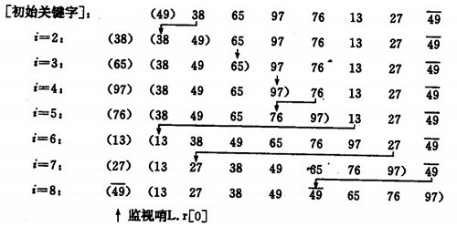

## 直接插入排序（straight insert sort）
基本思想:  
&emsp;&emsp;将一个记录插入到已排序好的有序表中，从而得到一个新，记录数增1的有序表。即：先将序列的第1个记录看成是一个有序的子序列，然后从第2个记录逐个进行插入，直至整个序列有序为止。  
要点：设立哨兵，作为临时存储和判断数组边界之用。  
直接插入排序示例：

&emsp;&emsp;如果碰见一个和插入元素相等的，那么插入元素把想插入的元素放在相等元素的后面。所以，相等元素的前后顺序没有改变，从原无序序列出去的顺序就是排好序后的顺序，所以插入排序是**稳定**的。

``` c#
示例代码：

public static int[] InsertSort(int[] list){
    if(list.Length<=1) return list;
    for(var i=1;i<list.Length;i++){
        if(list[i]<list[i-1]){
            var temp = list[i];
            var j = i-1;
            while(j>=0 && temp<list[j]){
                list[j+1]= list[j];
                j--;
            }
            list[j+1]=temp;
        }
    }
    return list;
}
```
时间复杂度：O(n^2）。
***

## 希尔排序
基本思想:  
&emsp;&emsp;改进的直接插入算法。设待排序的元素序列有n个元素，首先取一整数gap（<n）作为间隔，将全部元素分为gap个子序列，所有距离为gap的元素放在同一序列中，在每个子序列中分别进行直接插入排序。然后缩小gap，例如<code>gap=gap/2</code>,重复上述的子序列划分与排序工作。开始由于gap取值大，每个子序列元素少，排序速度快，待排序后期，gap值逐渐变小，子序列元素变多，但由于前面的工作基础，大多数元素已经有序，所以排序速度快。  
&emsp;&emsp;希尔排序是一种不稳定的排序。 

排序示例  
4,6,3,2,7,1,5,8,9  （gap = 9/2 =4）  
1. (4,7) - (6,1) - (3,5) - (2,8) - 9
2. 4 1 3 2 7 6 5 8 gap=2
3. (4,3,7,5) - (1,2,6,8)
4. 3 1 4 2 5 6 7 8 gap=1
5. 1 2 3 4 5 6 7 8

示例代码：
``` c#
public static int[] ShellSort(int[] list){
    int length = list.Length;
    if(length<=1) return list;
    int gap = length/2;
    while(gap>=1){
        for(var i=gap;i<length;i++){
            if(list[i]<list[i-gap]){
                var temp = list[i];
                var j = i-gap;
                while(j>=0&&temp<list[j]){
                    list[j+gap] = list[j];
                    j=j-gap;
                }
                list[j+gap]=temp;
            }
        }
        gap = gap/2;
    }
    return list;
}
```
&emsp;&emsp;希尔排序时效分析很难，关键码的比较次数与记录移动次数依赖于增量因子序列d的选取，特定情况下可以准确估算出关键码的比较次数和记录的移动次数。目前还没有人给出选取最好的增量因子序列的方法。增量因子序列可以有各种取法，有取奇数的，也有取质数的，但需要注意：增量因子中除1外没有公因子，且最后一个增量因子必须为1。
***
## 二分插入排序（binary insert sort）
基本思想:  
&emsp;&emsp;设在数据表中有一个元素序列v[0],v[1],v[2]......v[n].其中v[0],v[1],v[2]......v[i-1]是已经排好序的元素。在插入v[i]。利用折半搜索寻找v[i]的插入位置。  
&emsp;&emsp;二分插入排序是一种稳定的排序。当n较大时，总排序码比较次数比直接插入排序的最差情况好得多，但比最好情况要差，所元素初始序列已经按排序码接近有序时，直接插入排序比二分插入排序比较次数少。二分插入排序元素移动次数与直接插入排序相同，依赖于元素初始序列。  
实现逻辑：  
&emsp;&emsp;先跟序列最中间的那个元素比较，如果比最中间的这个元素小，则插入位置在它的左边，否则在它的右边。  
&emsp;&emsp;以当前最中间位置为分割点，如果在左边，则当前最中间位置是待搜索子序列的终点，如果在右边，右边邻接的元素将是待搜索子序列的起点。  
&emsp;&emsp;按照这种原则，继续寻找下一个中间位置，并继续这种过程，直到找到合适的插入位置为止。  

示例代码：   
``` c#
public static int[] BinaryInsertSort(int[] list){
    int length = list.Length;
    if(length<=1) return list;
    for(var i=1;i<length;i++){
        var temp = list[i];
        var head = 0;
        var tail = i-1;
        while(head<=tail){
            var mid = (head+tail)/2;
            if(temp< list[mid]){
                tail = mid - 1;
            }
            else{
                head = mid +1;
            }
        }
        for(var j = i-1;j>=head;j--){
            list[j+1]=list[j];
        }
        list[head] = temp;
    }
    return list;
}
```
最坏的情况下二分插入排序的时间复杂度依然是O(n^2)。  
如果待排序的序列已经有序，排序时间复杂度为O(nlogn)。