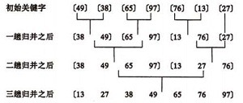

## 归并排序（bubble sort）
基本思想:  
&emsp;&emsp;归并（Merge）排序法是将两个（或两个以上）有序表合并成一个新的有序表，即把待排序序列分为若干个子序列，每个子序列是有序的。然后再把有序子序列合并为整体有序序列。  
冒泡排序的示例：  
   
示例代码：  
``` c#
public static int[] NormalMergeSort(int[] list){
    var result = new int[list.Length];
    // 初始提取间隔为1
    int interval = 1;
    while(interval < list.Length){
        int length = interval;
        interval = 2 * interval;
        int i = 0;
        // 每隔一定的间隔提取相邻2个序列进行归并
        while(i+interval<list.Length){
            Merge(list,result,i,i+length-1,i+interval-1);
            i += interval;
        }
        // 对于最后一组不够元素个数的序列进行归并
        if(i+length<=list.Length){
            Merge(list,result,i,i+length-1,list.Length-1);
        }
        // 交换list 和 result，避免空间浪费
        var tmp = list;
        list = result;
        result = tmp;
    }
    return result;
}
private static void Merge(int[] list,int[] result, int left, int mid, int right){
    int j,k;
    //原数组list 分为2部分,left...mid,mid+1...right,循环2部分的元素，按顺序存入result数组中。
    for(j=mid+1,k=left;left<=mid&&j<=right;++k){
        if(list[j]<list[left]){
            result[k] = list[j++];
        }
        else{
            result[k]=list[left++];
        }
    }
    //右边数组已经排完了，把其余左边的全加入进来即可。
    while(left<=mid){
        result[k++] = list[left++];
    }
    while(j<=right){
        result[k++] = list[j++];
    }
}
```

两路归并排序：  
``` c#
public static int[] TwoSidesMergeSort(int[] list){
    var result = new int[list.Length];
    int n =1;
    while(n<list.Length){
        MergePass(list,result,n);
        n*=2;
        if(n<list.Length){
            MergePass(result,list,n);
            n*=2;
        }
    }
    return list;
}

private static void MergePass(int[] list, int[] result, int length){
    for(int i=0;i<list.Length;i+=2*length){
        Merge(list,result,i,i+length,length);
    }
}
private static void Merge(int[] list, int[] result, int begin1, int begin2, int length){
    int i = begin1, j = begin2, k = begin1;
    while(i<begin1+length&&j<begin2+length&&j<list.Length){
        if(list[i]<list[j]){
            result[k++]=list[i++];
        }
        else{
            result[k++]=list[j++];
        }
    }
    while(i<begin1+length&&i<list.Length){
        result[k++] = list[i++];
    }
    while(j<begin2+length&&j<list.Length){
        result[k++] = list[j++];
    }

}
```