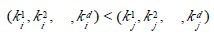

## 桶排序（bucket sort）
基本思想:  
&emsp;&emsp;将阵列分到有限数量的桶子里。每个桶子再个别排序（有可能再使用别的排序算法或是以递回方式继续使用桶排序进行排序）。桶排序是鸽巢排序的一种归纳结果。 当要被排序的阵列内的数值是均匀分配的时候，桶排序使用线性时间（Θ（n））。但桶排序并不是 比较排序，他不受到 O(n log n) 下限的影响。  
&emsp;&emsp;简单来说，就是把数据分组，放在一个个的桶中，然后对每个桶里面的在进行排序。   

例如要对大小为[1..1000]范围内的n个整数A[1..n]排序：  
1. 可以把桶设为大小为10的范围，具体而言，设集合B[1]存储[1..10]的整数，集合B[2]存储(10..20]的整数，……集合B[i]存储((i-1)*10, i*10]的整数，i= 1,2,..100。总共有100个桶。
2. 对A[1..n]从头到尾扫描一遍，把每个A[i]放入对应的桶B[j]中。 再对这100个桶中每个桶里的数字排序，这时可用冒泡，选择，乃至快排，一般来说任何排序法都可以。
3. 依次输出每个桶里面的数字，且每个桶中的数字从小到大输出，这样就得到所有数字排好序的一个序列了。
  
&emsp;&emsp;假设有n个数字，有m个桶，如果数字是平均分布的，则每个桶里面平均有n/m个数字。如果对每个桶中的数字采用快速排序，那么整个算法的复杂度是  
   O(n + m*n/m*  log(n/m)) = O(n + nlogn - nlogm)  
&emsp;&emsp;从上式看出，当m接近n的时候，桶排序复杂度接近O(n)。   
&emsp;&emsp;当然，以上复杂度的计算是基于输入的n个数字是平均分布这个假设的。这个假设是很强的  ，实际应用中效果并没有这么好。如果所有的数字都落在同一个桶中，那就退化成一般的排序了。  

&emsp;&emsp;前面说的几大排序算法 ，大部分时间复杂度都是O（n2），也有部分排序算法时间复杂度是O(nlogn)。而桶式排序却能实现O（n）的时间复杂度。但桶排序的缺点是：
* 首先是空间复杂度比较高，需要的额外开销大。排序有两个数组的空间开销，一个存放待排序数组，一个就是所谓的桶，比如待排序值是从0到m-1，那就需要m个桶，这个桶数组就要至少m个空间。
* 其次待排序的元素都要在一定的范围内等等。
  
&emsp;&emsp;桶式排序是一种分配排序。分配排序的特定是不需要进行关键码的比较，但前提是要知道待排序列的一些具体情况。  

设n个元素的待排序列包含d 个关键码{k1，k2，…，kd}，则称序列对关键码{k1，k2，…，kd}有序是指：  
对于序列中任两个记录r[i]和r[j](1≤i≤j≤n)都满足下列有序关系：
   
其中k1 称为最主位关键码，kd 称为最次位关键码.

<font color="lightblue">两种多关键码排序方法：</font>  
&emsp;&emsp;多关键码排序按照从最主位关键码到最次位关键码或从最次位到最主位关键码的顺序逐次排序，分两种方法：  

* **最高位优先(Most Significant Digit first)法**，简称MSD 法：  
    1. 先按k1 排序分组，将序列分成若干子序列，同一组序列的记录中，关键码k1 相等。
    2. 再对各组按k2 排序分成子组，之后，对后面的关键码继续这样的排序分组，直到按最次位关键码kd 对各子组排序后。
    3. 再将各组连接起来，便得到一个有序序列。扑克牌按花色、面值排序中介绍的方法一即是MSD 法。  

* **最低位优先(Least Significant Digit first)法**，简称LSD 法：  
    1. 先从kd 开始排序，再对kd-1进行排序，依次重复，直到按k1排序分组分成最小的子序列后。
    2. 最后将各个子序列连接起来，便可得到一个有序的序列, 扑克牌按花色、面值排序中介绍的方法二即是LSD 法。


**基于LSD方法的链式基数排序的基本思想**  
&emsp;&emsp;“多关键字排序”的思想实现“单关键字排序”。对数字型或字符型的单关键字，可以看作由多个数位或多个字符构成的多关键字，此时可以采用“分配 -收集”的方法进行排序，这一过程称作基数排序法，其中每个数字或字符可能的取值个数称为基数。比如，扑克牌的花色基数为4，面值基数为13。在整理扑克 牌时，既可以先按花色整理，也可以先按面值整理。按花色整理时，先按红、黑、方、花的顺序分成4摞（分配），再按此顺序再叠放在一起（收集），然后按面值 的顺序分成13摞（分配），再按此顺序叠放在一起（收集），如此进行二次分配和收集即可将扑克牌排列有序。

## 基数排序(radix sort)
&emsp;&emsp;是按照低位先排序，然后收集；再按照高位排序，然后再收集；依次类推，直到最高位。有时候有些属性是有优先级顺序的，先按低优先级排序，再按高优先级排序。最后的次序就是高优先级高的在前，高优先级相同的低优先级高的在前。基数排序基于分别排序，分别收集，所以是稳定的。

示例代码：  
``` c#
public static int[] RadixSort(int[] list){
    sort(list, 2);
    return list;
}

private static void sort(int[] list, int d){//d表示最大的数有多少位
    int k =0;
    int n =1;
    int m =1;//控制键值排序依据在哪一位
    var temp = new int[10,list.Length];//数组的第一维表示可能的余数0-9
    var order = new int[10];//数组orderp[i]用来表示该位是i的数的个数
    while(m<=d){
        //循环将数组中的值放入到相应的桶temp[lsd]中
        for(int i = 0; i < list.Length; i++)
        {
            int lsd = ((list[i] / n) % 10);
            temp[lsd, order[lsd]] = list[i];
            order[lsd]++;
        }
        //将temp中的值给回list，最低位优先LSD
        for(int i = 0; i < 10; i++)
        {
            if(order[i] != 0)
                for(int j = 0; j < order[i]; j++)
                {
                    list[k] = temp[i,j];
                    k++;
                }
            order[i] = 0;
        }
        n *= 10;
        k = 0;
        m++;
    }
}
```