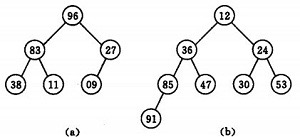
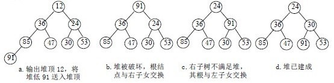
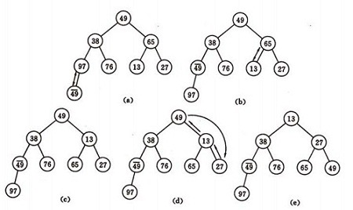

## 简单选择排序（simple selection sort）
基本思想:  
&emsp;&emsp;在要排序的一组数中，选出最小（或者最大）的一个数与第1个位置的数交换；然后在剩下的数当中再找最小（或者最大）的与第2个位置的数交换，依次类推，直到第n-1个元素（倒数第二个数）和第n个元素（最后一个数）比较为止。

排序示例  
4,6,3,2,7,1,5,8,9    
1. 1 6 3 2 7 4 5 8 9
2. 1 2 3 6 7 4 5 8 9
3. 1 2 3 4 7 6 5 8 9
4. 1 2 3 4 5 6 7 8 9

代码示例：  
``` C#
public static int[] SimpleSelectionSort(int[] list){
    if(list.Length<=1) return list;
    for(var i=0;i<list.Length;i++){
        var index = i;
        var minKeyIndex = i;
        var temp = list[i];
        var j = i;
        while(j<list.Length){
            if(list[j]<temp){
                minKeyIndex = j;
                temp = list[j];
            }
            j++;
        }
        if(minKeyIndex!=i){
            var t = list[i];
            list[i] = list[minKeyIndex];
            list[minKeyIndex] = t;
        }
    }
    return list;
}
```
***
## 二元选择排序（binary selection sort）
基本思想:  
&emsp;&emsp;简单选择排序，每趟循环只能确定一个元素排序后的定位。我们可以考虑改进为每趟循环确定两个元素（当前趟最大和最小记录）的位置,从而减少排序所需的循环次数。改进后对n个数据进行排序，最多只需进行[n/2]趟循环即可。  
代码示例：  
``` C#
public static int[] BinarySelectionSort(int[] list){
    var length = list.Length;
    if(length<=1) return list;
    for(var i=0;i<=length/2;i++){
        var min = i;
        var max = length - i -1;

        for(var j=i+1;j<length-i;j++){
            if(list[j]<list[min]){
                min = j;
            }
            else if(list[j]>list[max]){
                max = j;
            }
        }
        if(min!=i){
            var t = list[i];
            list[i] = list[min];
            list[min] = t;
        }
        if(max!=length-i-1){
            var t = list[length-i-1];
            list[length-i-1] = list[max];
            list[max] = t;
        }
    }
    return list;
}
```
***
## 堆排序（heap sort）
堆排序是一种树形选择排序，是对直接选择排序的有效改进。  
基本思想:  
&emsp;&emsp;简单选择排序，每趟循环只能确定一个元素排序后的定位。我们可以考虑改进为每趟循环确定两个元素（当前趟最大和最小记录）的位置,从而减少排序所需的循环次数。改进后对n个数据进行排序，最多只需进行[n/2]趟循环即可。   
堆的定义如下：  
具有n个元素的序列（k1,k2,...,kn),当且仅当满足:
* k<sub>i</sub> &le; k<sub>2i</sub>
* k<sub>i</sub> &le; k<sub>2i+1</sub>  
或者
* k<sub>i</sub> &ge; k<sub>2i</sub>
* k<sub>i</sub> &ge; k<sub>2i+1</sub>  
(i=1,2,3...&lfloor;n/2&rfloor;)  

时称之为堆。  
&emsp;&emsp;由堆的定义可以看出，堆顶元素（即第一个元素）必为最小项（小顶堆）。  
&emsp;&emsp;若以一维数组存储一个堆，则堆对应一棵完全二叉树，且所有非叶结点的值均不大于(或不小于)其子女的值，根结点（堆顶元素）的值是最小(或最大)的。  
如：  
* (a)大顶堆序列：（96, 83,27,38,11,09)  
* (b)小顶堆序列：（12，36，24，85，47，30，53，91）  
  

&emsp;&emsp;初始时把要排序的n个数的序列看作是一棵顺序存储的二叉树（一维数组存储二叉树）， 调整它们的存储顺序，使之成为一个堆，将堆顶元素输出，得到n个元素中最小(或最大)的元素，这时堆的根节点的数最小（或者最大）。然后对前面(n-1)个元素重新调整使之成为堆，输出堆顶元素，得到n个元素中次小(或次大)的元素。依此类推，直到只有两个节点的堆，并对它们作交换，最后得到有n个节点的有序序列。称这个过程为**堆排序**。  

因此，实现堆排序需解决两个问题：
1. 如何将n 个待排序的数建成堆；
2. 输出堆顶元素后，怎样调整剩余n-1 个元素，使其成为一个新堆。

&emsp;&emsp;首先讨论第二个问题：输出堆顶元素后，对剩余n-1元素重新建成堆的调整过程。  
调整小顶堆的方法：  
1. 设有m 个元素的堆，输出堆顶元素后，剩下m-1 个元素。将堆底元素送入堆顶（（最后一个元素与堆顶进行交换），堆被破坏，其原因仅是根结点不满足堆的性质。
2. 将根结点与左、右子树中较小元素的进行交换。
3. 若与左子树交换：如果左子树堆被破坏，即左子树的根结点不满足堆的性质，则重复方法 2
4. 若与右子树交换，如果右子树堆被破坏，即右子树的根结点不满足堆的性质。则重复方法 2
5. 继续对不满足堆性质的子树进行上述交换操作，直到叶子结点，堆被建成。  

称这个自根结点到叶子结点的调整过程为筛选。如图：  
 

再讨论对n 个元素初始建堆的过程。  

建堆方法：对初始序列建堆的过程，就是一个反复进行筛选的过程。  
1. n 个结点的完全二叉树，则最后一个结点是第&lfloor;n/2&rfloor;个结点的子树。
2. 筛选从第&lfloor;n/2&rfloor;个结点为根的子树开始，该子树成为堆。
3. 之后向前依次对各结点为根的子树进行筛选，使之成为堆，直到根结点。  
如图建堆初始过程：  
 
无序序列：（49，38，65，97，76，13，27，49）

示例代码：  
``` c#
public static int[] HeapSort(int[] list){
    var length = list.Length;
    if(length<=1) return list;
    //首先建立一个堆，堆顶为数组中最大的元素
    //依据2*(index+1)<=length => index <= length/2 - 1 
    for(var i= length/2 -1 ;i>=0;i--){
        HeapConstruct(list,i,length);
    }
    //倒序循环，对换堆顶到队尾，依次构造堆。
    for(var i =length-1;i>0;i--){
        var temp = list[i];
        list[i] = list[0];
        list[0] = temp;
        HeapConstruct(list,0,i);
    }
    return list;
}
private static void HeapConstruct(int[] list,int startIndex, int length){
    
    var currentIndex = startIndex;
    var temp = list[currentIndex];
    var leftChildIndex = (currentIndex+1)*2 -1;
    
    //循环找到左儿子是否还在值的范围内
    while(leftChildIndex<length){
        var biggerChild = leftChildIndex;
        var rightChildIndex = leftChildIndex+1;
        if(rightChildIndex < length && list[rightChildIndex]> list[leftChildIndex]){
            biggerChild = rightChildIndex;
        }
        if(temp < list[biggerChild]){               
            //如果比较大的子节点比自己大，那么互换节点的值。
            list[currentIndex] = list[biggerChild];
            list[biggerChild] = temp;
            //当前节点指向较大的那个子节点
            currentIndex = biggerChild;
            //找到较大子节点的左儿子
            leftChildIndex = (biggerChild+1)*2-1;
            temp =list[currentIndex];    
        }
        else{    
            //如果当前节点比儿子节点都大则终止循环           
            break;
        }      
    }        
}
```
效率：  

设树深度为k，
k = &lfloor;log<sub>2</sub>n&rfloor; +1
。从根到叶的筛选，元素比较次数至多2(k-1)次，交换记录至多k 次。所以，在建好堆后，排序过程中的筛选次数不超过下式:  
2(&lfloor;log<sub>2</sub>(n-1)&rfloor; + &lfloor;log<sub>2</sub>(n-2)&rfloor; + …… + &lfloor;log<sub>2</sub>2&rfloor;) < 2n(&lfloor;log<sub>2</sub>n&rfloor;)  
而建堆时的比较次数不超过4n 次，因此堆排序最坏情况下，时间复杂度也为：O(nlogn)。